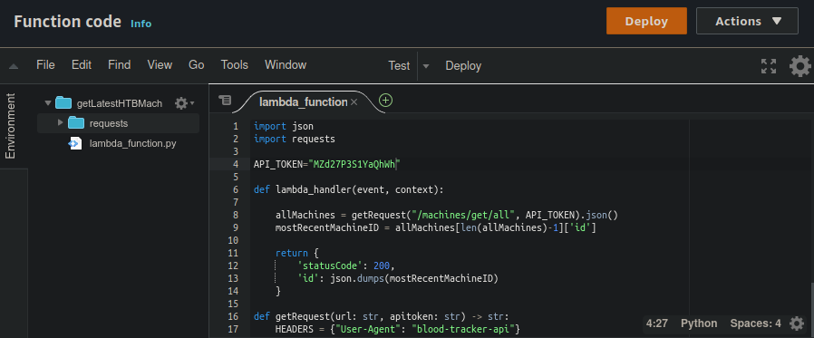
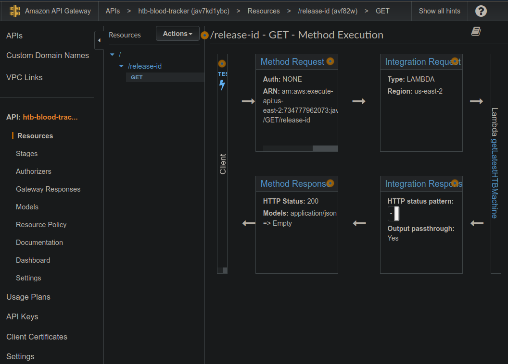

.. _QuickStart:

QuickStart
^^^^^^^^^^

.. topic:: Setting Up the API  

AWS Lambda
  You will need an API to parse the HTB machines list to retrieve the most recently released machine on HTB. 
  Thanks to AWS Lambda the whole process is really easy. AWS Lambda lets us set up a function that we can call anytime we want,
  we just have to make sure that it is exposed with an API so that our Particle Cloud queries can reach it.

  You can make your Lambda function look similar to the one I have provided in the sourecode, or take liberties and alter it and make it your own.
  Note the requests folder. This can be downloaded to your local machine with pip:

  .. code-block:: bash
     :linenos:
    
     pip install requests -t ./

  And then you can zip the requests module folder along with your lambda_function.py with:

  .. code-block:: bash
     :linenos:

     zip package.zip lambda_function.py requests/

  In AWS your completed Lambda function will look much like the one in the screenshot below:

AWS API Gateway
  I setup my AWS API Gateway to point to the lambda function that I created. I set a rate limit of 1 request per second
  with a burst of 2 requests per second. I kept this rate limit as I wanted to be sure that throughout the course of the 1 year free
  trial I did not exceed the total number of requests, even by accident. I also generated an API token for my user account
  so that I could be sure that nobody else was able to run the AWS bill up on my behalf. My API Gateway config looked like this:

   

:ref:`Parts`