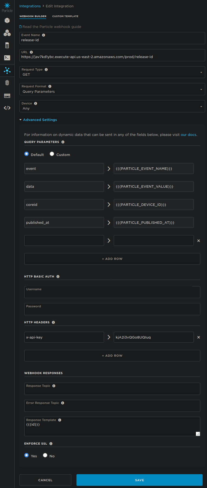
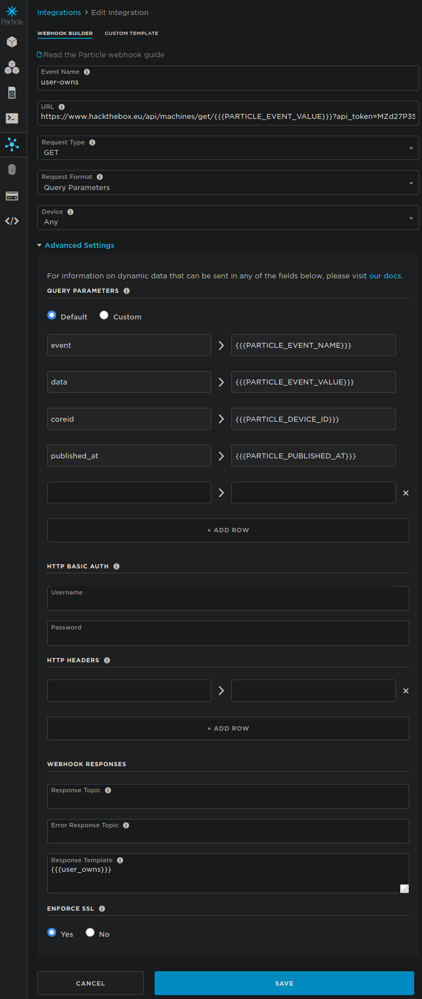
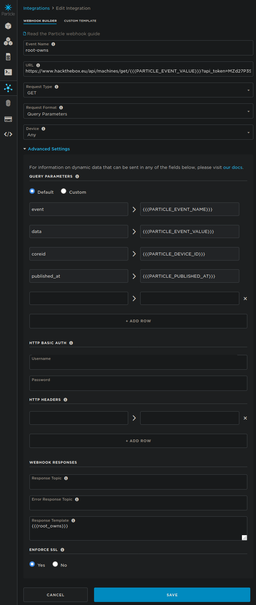

.. _QuickStart:

QuickStart
^^^^^^^^^^

Lets get started by cloning the sourcecode repository:

.. code-block:: bash

   git clone https://github.com/rmccarth/blood-tracker.git

.. topic:: Setting Up an AWS Lambda Function 

  You will need an API to parse the HTB machines list to retrieve the most recently released machine on HTB. 
  Thanks to AWS Lambda the whole process is really easy. AWS Lambda lets us set up a function that we can call anytime we want,
  we just have to make sure that it is exposed with an API so that our Particle Cloud queries can reach it.

  You can make your Lambda function look similar to the one I have provided in the sourecode, or take liberties and alter it and make it your own.
  Note the requests folder. This can be downloaded to your local machine with pip:

  .. code-block:: bash
    
     pip install requests -t ./

  And then you can zip the requests module folder along with your lambda_function.py with:

  .. code-block:: bash

     zip package.zip lambda_function.py requests/

  In AWS your completed Lambda function will look much like the one in the screenshot below:

.. image:: images/lambda.png
   :width: 600

.. topic:: Setting Up an AWS API Gateway

  I setup my AWS API Gateway to point to the lambda function that I created. I set a rate limit of 1 request per second
  with a burst of 2 requests per second. I kept this rate limit as I wanted to be sure that throughout the course of the 1 year free
  trial I did not exceed the total number of requests, even by accident. I also generated an API token for my user account
  so that I could be sure that nobody else was able to run the AWS bill up on my behalf. My API Gateway config looked like this:

  The AWS API Gateway gives you a URL to hit with your requests.

.. code-block:: bash

   curl https://jav7kd1ybc.execute-api.us-east-2.amazonaws.com/prod/release-id 

.. image:: images/api-config.png
   :width: 600

.. topic:: Setting Up Particle Webhook for AWS API Gateway

  Now that our API is configured to parse the HTB API, we can configure our
  Particle webhooks to hit both our AWS API as well as the HTB API to query the
  most recently released box and that boxes statistics respectively.

  The first webhook which queries our AWS API is configured by going to 'integrations' in the
  Particle Console, and then creating a new integration as such:

.. topic:: Setting Up Particle user-owns Webhook

  Note that I've removed half of my API key for confidentiality, however its vital that if your
  API requires a key, you provide it in the header like I did here. Also note the "{{{id}}}" 'Moustache' Response Template.
  This Moustache syntax allows you to select the field out of the JSON response which you would like to capture.
  In our case we will capture the only value passed by our API and use it in our Particle Firmware to 
  make further requests against the HTB API for box statistics. 

  The next two webhooks we will need to setup are the user-owns webhook, and the root-owns webhook. 
  Their format is very similar, but you will note the passing of the HTB API key (which you can find in your HTB profile section)
  directly in the URL of the webhook. 

.. topic:: Setting Up Particle root-owns Webhook

  And lastly the root-owns webhook which is identical to the user-owns webhook except it parses
  for root-owns rather than user-owns:

.. topic:: Next Steps!

   Now lets get into the code! Fire up your Particle Web IDE, create a new project, and head over to the :ref:`Code` documentation
   for a full explanation of how the code works!

:ref:`Parts`